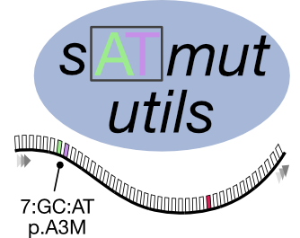

satmut_utils is a Python package for simulation and variant calling of saturation mutagenesis data. The two main subcommands are:
1. sim
2. call

satmut_utils commands are designed to simulate and call variants in paired-end, targeted RNA-seq datasets. That is, alignments for a single transcript are expected. 

[Installation](#Installation)

[Reference files](#Reference-files)

[Code examples](#Code-examples)

[Run sim](#Run-sim)

[Run call](#Run-call)

[Tests](#Tests)

## Installation

Currently, only Linux and MacOSX operating systems are supported. 

To get started, clone the satmut_utils repository, create a conda environment, and download or generate your own reference files. This process is as follows:

1. Acquire the code base by cloning the satmut_utils repository:

```
git clone https://github.com/ijhoskins/satmut_utils.git
```

2. Install miniconda for managing environments and packages. See this [link](https://docs.conda.io/en/latest/miniconda.html) for installation.

3. Create the conda environment and activate it:
```
conda env create -f satmut_utils/satmut_utils_env.yaml
conda activate satmut_utils
```

4. If using Ensembl identifiers, download reference files. If using custom reference files, [see Reference files](#Reference-files).

Create a reference directory and get the curated human transcript reference files:
```
REF_DIR="/tmp/satmut_utils_refs"
mkdir $REF_DIR
git clone https://github.com/ijhoskins/satmut_utils_refs.git
cp satmut_utils_refs/* $REF_DIR
gunzip $REF_DIR/*gz
```

Download the human genome FASTA (if need be, with a FTP client application). If you already have the GRCh38 FASTA, you may use it provided the chromosome names start with a single integer (NCBI format, not the UCSC "chr" format). This is important for compatibility with the curated transcript annotations.

Move or soft link the genome FASTA to the REF\_DIR using the name GRCh38.fa, then index it with samtools:

```
# FTP link to NCBI-formatted genome ftp://ftp.ensembl.org/pub/release-84/fasta/homo_sapiens/dna/Homo_sapiens.GRCh38.dna.primary_assembly.fa.gz

mv ~/Downloads/Homo_sapiens.GRCh38.dna.primary_assembly.fa.gz $REF_DIR/GRCh38.fa.gz
gunzip $REF_DIR/GRCh38.fa.gz
samtools faidx $REF_DIR/GRCh38.fa
```

5. Navigate to the satmut\_utils repository and install the package:

```
cd satmut_utils
python3 -m pip install --upgrade build
python3 -m build
pip install .
```

You are now ready to call the command-line executables:

1. satmut\_utils
2. satmut\_trim
3. satmut\_align

satmut\_utils is the primary command, with subcommands sim and call.
 
satmut\_trim is a wrapper around cutadapt enabling pre-processing of reads prior to  satmut\_align. satmut\_align should be used to generate the BAM file accepted by sim. If reads have been aligned with some other method, there is no guarantee sim will complete without error, as alignment tags output by bowtie2 are required for sim.

## Code examples

See docs/satmut\_utils\_manual.md for more detailed usage information.

Parameter help:
```
satmut_utils -h
satmut_utils sim -h
satmut_utils call -h
```

It is recommended that a new output directory is created for each job. Default is to output to the current directory.
```OUTPUT_DIR="/tmp/satmut_utils_test"```

Common arguments to both sim and call subcommands should be provided first, then the subcommand, and then the subcommand-specific arguments.

### Run sim

Run sim on *in silico* alignments to generate SNPs, MNPs, and InDels. Structural variants and gene fusions are not currently supported.

```
TEST_DIR="satmut_utils/src/tests/test_data"
satmut_utils -i ENST00000398165.7 -x $REF_DIR -o $OUTPUT_DIR -p $TEST_DIR/CBS_sim_primers.bed sim -f -a $TEST_DIR/CBS_sim.bam -v $TEST_DIR/CBS_sim.vcf
```

The sim workflow outputs paired FASTQs, a realigned BAM file, and a truth VCF containing simulated variants and their expected counts and frequencies.

### Run call

Run call on the simulated data by specifying an Ensembl transcript/gene ID and the directory containing curated reference files:
```
TEST_DIR="satmut_utils/src/tests/test_data"
satmut_utils -i ENST00000398165.7 -x $REF_DIR -o $OUTPUT_DIR -p $TEST_DIR/CBS_sim_primers.bed call -1 $TEST_DIR/CBS_sim.R1.fq.gz -2 $TEST_DIR/CBS_sim.R2.fq.gz -v
```

Here, we call variants on a simulated dataset with no adapter sequences, so we pass -v. However, in most cases the user should provide 5' and 3' adapters for trimming.

If the Ensembl ID is not in the curated set of primary transcripts, or if you want to align to a custom reference, several reference files most be provided. [Reference files](#Reference-files).

```
satmut_utils -r $TEST_DIR/CBS.fa -o $OUTPUT_DIR -p $TEST_DIR/CBS_sim_primers.bed call -1 $TEST_DIR/CBS_sim.R1.fq.gz -2 $TEST_DIR/CBS_sim.R2.fq.gz -v -g $TEST_DIR/CBS.gff -k $REF_DIR/GRCh38.fa
```

The call workflow produces a VCF of candidate variant calls as well as a BED file reporting fragment coverage across the reference. The output VCF and its corresponding tab-delimited summary.txt file contain records for each mismatched base in an MNP. See the VCF header for column/field descriptions.

A number of useful R functions exist in src/prototype/summarization_utils.r for parsing and summarizing the output VCF summary files.

## Reference files

For convenience, a curated transcriptome of primary human transcripts from APPRIS is provided, allowing the user to pass an Ensembl gene or transcript ID to satmut_utils. However, if the requested Ensembl ID is not found in this set, custom reference files must be passed, which include:

A. Transcript reference (FASTA)

B. Transcript annotations (GFF)

C. GFF reference (FASTA)

Common transcript annotations in GFF format (file B) map coordinates in the genome. For this typical case, file A should specify a transcript FASTA and file C should specify the genome FASTA.

In typical saturation mutagenesis datasets, an intron-less coding sequence, lacking endogenous untranslated regions, is expressed from a vector. In this case, set file A and C to the same composite (vector + coding sequence) reference FASTA, then make a custom GFF annotation (file B) with a single exon and CDS feature. See the user manual for more details on creating custom reference files.

## Tests

To run unit tests, execute the following from the satmut_utils repository:

```nose2 -q```

